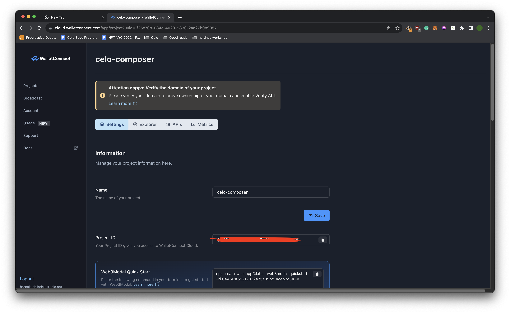

<!-- TITLE -->
<p align="center"> 
  
 <h1 align="center">Nexus</h1>
</p>

<!-- TABLE OF CONTENTS -->

<details>
  <summary>Table of Contents</summary>
  <ol>
    <li>
      <a href="#about-the-project">About The Project</a>
      <ul>
        <li><a href="#built-with">Built With</a></li>
      </ul>
    </li>
    <li>
      <ul>
        <li><a href="#prerequisites">Prerequisites</a></li>
        <li><a href="#installation">Installation</a></li>
      </ul>
    </li>
    <li><a href="#usage">Usage</a></li>
    <li><a href="#roadmap">Roadmap</a></li>
    <li><a href="#contributing">Contributing</a></li>
    <li><a href="#license">License</a></li>
    <li><a href="#contact">Contact</a></li>
    <li><a href="#acknowledgments">Acknowledgments</a></li>
  </ol>
</details>

<!-- ABOUT THE PROJECT -->

## About The Project

Nexus allows you to quickly build, deploy, and iterate on SocialConnect inside MiniPay.

<p align="right">(<a href="#top">back to top</a>)</p>

## Built With

Nexus is built on Celo to make it simple to test SocialConnect features inside MiniPay site tester.

-   [Celo](https://celo.org/)
-   [SocialConnect](https://github.com/celo-org/social-connect/tree/main)
-   [Next.js](https://nextjs.org/)

<p align="right">(<a href="#top">back to top</a>)</p>

<!-- GETTING STARTED -->

## Prerequisites

-   Node (v18)

## How to use Nexus

### Clone the repo

```bash
git clone https://github.com/celo-org/nexus.git
```

### Install the packages

```bash
yarn
```

### Setup Environment Variables

All the following variables go in the `/packages/react-app/.env.local` file (you can create a copy from `.env.local.example`)

#### Get WalletConnect Project ID

Sign up for WalletConnect and get the project id.



#### Setup Issuer and Issuer DEK

The steps to setup issuer and issuer DEK are [here](https://github.com/celo-org/social-connect/blob/main/docs/key-setup.md).

#### Environment

You can use either `MAINNET` or `TESTNET` as the values for `NEXT_PUBLIC_ENVIRONMENT`, depending on which the RPC and Contract Addresses change.

### Run the project

You can use the following command to run the project locally.

```bash
yarn dev
```

This will start the app at `http://localhost:3000`.

Since, this app is running on localhost and cannot be opened in MiniPay we need to create a tunnel we will use [ngrok](https://ngrok.com/) for the same.

1. Create an account on ngrok, setup ngrok on your machine.

    > [!NOTE]
    > ngrok is offering free static domain, use that so the url of the app does not change!

2. Use the following command, to start the tunnel.

    If you have the static domain

    ```bash
    ngrok http --domain=<STATIC_DOMAIN> 3000
    ```

    If not

    ```bash
    ngrok http 3000
    ```

### How to test your DApp in MiniPay

1. Open the MiniPay app on your phone and click on compass icon.

    

2. Click on "Test Page" to open the MiniPay test page.

    

3. Enter the URL of your DApp and click on "Go".

    

## Support

Team at Celo keeps a constant eye on issues, so please open an issue [here](https://github.com/celo-org/nexus/issues) and also feel free to introduce yourself, share progress and engage with other MiniPay partners and the Celo team here in [discussions](https://github.com/celo-org/nexus/discussions).

<!-- CONTRIBUTING -->

## License

Distributed under the MIT License. See `LICENSE.txt` for more information.

<!-- CONTACT -->

## Contact

-   [@CeloDevs](https://twitter.com/CeloDevs)
-   [Discord](https://discord.com/invite/celo)
-   [Email](devrel@celo.org)

<p align="right">(<a href="#top">back to top</a>)</p>
